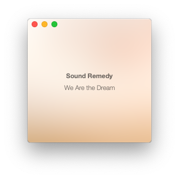

# 3000

a minimal music player for macOS.

The main feature of the app is that it can play music from a folder and it
treats it as a playlist. **Only MP3 and M4A files are supported**. For the
player to show artwork the metadata has to be set.

Use at your own risk.

## Why not use iTunes?

Whenever I tried using iTunes for this it has always copied over the files.  I
could probably disable this, but wanted to scratch an itch and do some
programming just for fun again.

## Keybindings

| Key   |                              |
| ----- | ---------------------------- |
| Space | Play or pause                |
| +     | Volume up                    |
| -     | VolumeDown                   |
| l     | Loop track                   |
| r     | Random  track                |
| n     | Next track                   |
| p     | Previous track               |
| m     | Mute track                   |
| t     | List tracks                  |
| Esc   | Hide tracks                  |
| i     | Show track info file for Obs |

## Screenshots

